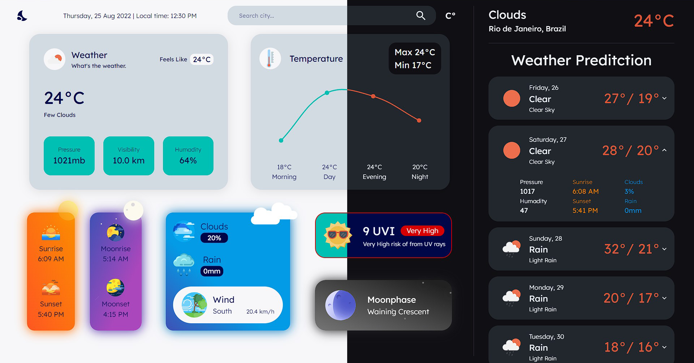

# Weather 

## About

Weather developed with ReactJS.

Site: https://appreact-weather.netlify.app/
 
 

## Features

- Search city.
- Theme Swicther.
- Temperature unit change.
- Autocomplete

 

 
 

# Tech Stack

- Typescript
- ReactJS
- Material UI (MUI)
- Luxon
- ChartJS
- Open Weather API
- GeoDB API

 

### Author

Nathan Stabille

https://www.linkedin.com/in/nathan-stabille
https://nathanstabille.vercel.app/
